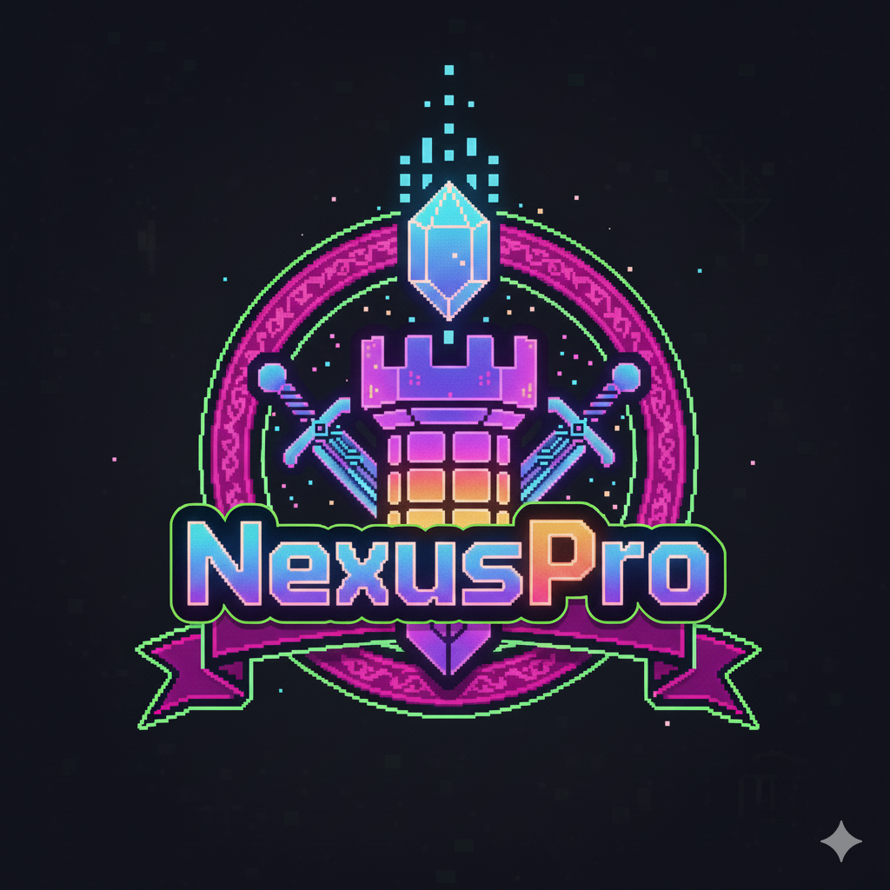

# 🎮 NexusPro - Documentação Completa
## Portal de Vagas Gamificado | Pixel Art RPG + Cores Modernas

---

## 📋 Índice

### PARTE 1: IDENTIDADE VISUAL
1. [Logo e Paleta de Cores](#logo-e-paleta-de-cores)
2. [Conceito Visual](#conceito-visual)
3. [Sistema de Cores](#sistema-de-cores)
4. [Tipografia](#tipografia)

### PARTE 2: PLANO DE REDESIGN
5. [Objetivo do Redesign](#objetivo-do-redesign)
6. [O que Manter vs. O que Mudar](#o-que-manter-vs-o-que-mudar)
7. [Checklist de Implementação](#checklist-de-implementação)
8. [Ordem de Implementação](#ordem-de-implementação)

### PARTE 3: COMPONENTES UI
9. [Botões Pixel Art](#botões-pixel-art)
10. [Cards e Badges](#cards-e-badges)
11. [Elementos Gamificados](#elementos-gamificados)
12. [Estrutura HTML/PHP](#estrutura-htmlphp)

### PARTE 4: REFERÊNCIA
13. [Animações e Efeitos](#animações-e-efeitos)
14. [Exemplos de Código](#exemplos-de-código)
15. [Recursos](#recursos)

---

# PARTE 1: IDENTIDADE VISUAL

## 🎨 Logo e Paleta de Cores

### Logo Oficial NexusPro



### Análise da Logo

A logo **NexusPro** apresenta uma identidade visual moderna e profissional que combina elementos tecnológicos com um design clean e impactante.

#### Elementos Visuais

1. **Tipografia**
   - Fonte: Sans-serif moderna e geométrica
   - Estilo: Bold/Heavy weight
   - Características: Letras com cantos arredondados
   - Efeito: Gradiente vibrante aplicado ao texto

2. **Paleta de Cores Extraída**
   ```css
   /* Cores principais da logo NexusPro */
   --nexus-purple: #8B5CF6;      /* Roxo vibrante - cor primária */
   --nexus-pink: #EC4899;        /* Rosa/magenta - cor secundária */
   --nexus-blue: #3B82F6;        /* Azul elétrico - acento */
   
   /* Gradiente principal */
   background: linear-gradient(135deg, #8B5CF6 0%, #EC4899 100%);
   ```

3. **Elementos Gráficos**
   - Ícone: Símbolo abstrato/geométrico
   - Estilo: Moderno, tech-forward, profissional
   - Conceito: Conexão, rede, nexo

---

## 🎯 Conceito Visual

### Pixel Art RPG + Cores Modernas da Logo

O **NexusPro** é um portal de vagas de emprego com design **pixel art RPG gamificado**, que transforma a busca por oportunidades profissionais em uma experiência interativa e motivadora, agora com a **paleta de cores moderna** da logo oficial.

#### Filosofia do Design

**"Pixel art com alma moderna"** - Mantemos a essência retrô e gamificada que torna o projeto único, mas atualizamos as cores para refletir a identidade visual profissional da logo NexusPro.

#### Elementos do Design

O design combina:
- ✅ **Pixel Art Retrô** - Estética de jogos 8-bit/16-bit (MANTIDO)
- ✅ **Cores Modernas** - Paleta da logo: roxo, rosa e azul (NOVO)
- ✅ **RPG Elements** - Sistema de níveis, XP, badges e conquistas (MANTIDO)
- ✅ **Efeitos Neon** - Glows e sombras com as novas cores (ATUALIZADO)
- ✅ **Dark Mode** - Fundo escuro slate com elementos luminosos (ATUALIZADO)

---

## 🎨 Sistema de Cores

### Paleta Completa do Projeto

```css
:root {
    /* === CORES PRIMÁRIAS (da Logo) === */
    --primary-purple: #8B5CF6;        /* Roxo principal */
    --primary-pink: #EC4899;          /* Rosa/magenta */
    --primary-blue: #3B82F6;          /* Azul elétrico */
    
    /* === GRADIENTES === */
    --gradient-primary: linear-gradient(135deg, #8B5CF6 0%, #EC4899 100%);
    --gradient-secondary: linear-gradient(135deg, #3B82F6 0%, #8B5CF6 100%);
    --gradient-accent: linear-gradient(135deg, #EC4899 0%, #F97316 100%);
    
    /* === BACKGROUNDS === */
    --bg-dark: #0F172A;               /* Fundo escuro principal (slate-900) */
    --bg-darker: #020617;             /* Fundo mais escuro (slate-950) */
    --bg-card: #1E293B;               /* Cards (slate-800) */
    --bg-elevated: #334155;           /* Elementos elevados (slate-700) */
    
    /* === CORES DE ACENTO === */
    --accent-cyan: #06B6D4;           /* Ciano - informação */
    --accent-orange: #F97316;         /* Laranja - ênfase */
    --accent-green: #10B981;          /* Verde - sucesso */
    --accent-red: #EF4444;            /* Vermelho - alertas */
    
    /* === TEXTO === */
    --text-primary: #F8FAFC;          /* Branco suave */
    --text-secondary: #CBD5E1;        /* Cinza claro */
    --text-muted: #64748B;            /* Cinza médio */
    
    /* === EFEITOS GLOW === */
    --glow-purple: rgba(139, 92, 246, 0.5);
    --glow-pink: rgba(236, 72, 153, 0.5);
    --glow-blue: rgba(59, 130, 246, 0.5);
}
```

### Hierarquia de Cores

| Nível | Cor | Uso | Código |
|-------|-----|-----|--------|
| **Primário** | Roxo | Botões principais, CTAs, elementos importantes | `#8B5CF6` |
| **Secundário** | Rosa | Destaques, hover states, badges especiais | `#EC4899` |
| **Acento** | Azul | Links, informações, elementos interativos | `#3B82F6` |
| **Sucesso** | Verde | Confirmações, vagas disponíveis | `#10B981` |
| **Atenção** | Laranja | Avisos, prazos próximos | `#F97316` |
| **Erro** | Vermelho | Erros, vagas expiradas | `#EF4444` |

### Sistema de Raridades (Gamificação)

| Raridade | Cor Antiga | Cor Nova | Código |
|----------|------------|----------|--------|
| **Comum** | Verde `#00ff88` | Verde `#10B981` | Tom moderno |
| **Raro** | Azul `#00d4ff` | Azul `#3B82F6` | Azul da logo |
| **Épico** | Roxo `#aa00ff` | Roxo `#8B5CF6` | Roxo da logo |
| **Lendário** | Dourado `#ffd700` | Gradiente Roxo→Rosa | `linear-gradient(135deg, #8B5CF6, #EC4899)` |

---

## ✍️ Tipografia

### Fontes Pixel Art (MANTIDAS)

O projeto usa fontes pixel art que serão **100% mantidas**:

```html
<!-- Fontes do projeto - NÃO ALTERAR -->
<link href="https://fonts.googleapis.com/css2?family=Press+Start+2P&family=VT323&family=Orbitron:wght@400;700;900&display=swap" rel="stylesheet">
```

#### 1. Press Start 2P - Títulos Pixel Art
```css
font-family: 'Press Start 2P', cursive;
```
- **Uso**: Títulos principais, badges, botões importantes
- **Características**: Fonte pixel art estilo arcade
- **Exemplo**: Títulos de seção, níveis, raridades

#### 2. VT323 - Texto Monospace Retrô
```css
font-family: 'VT323', monospace;
```
- **Uso**: Corpo de texto, descrições, labels
- **Características**: Monospace com estilo terminal
- **Exemplo**: Descrições de vagas, subtítulos

#### 3. Orbitron - Títulos Futuristas
```css
font-family: 'Orbitron', sans-serif;
```
- **Uso**: Títulos de cards, nomes de vagas
- **Características**: Geométrica e futurista
- **Pesos**: 400, 700, 900

#### 4. Sansation - Texto Auxiliar
```css
font-family: 'Sansation', sans-serif;
```
- **Uso**: Textos complementares
- **Pesos**: 300, 400, 700

### Aplicação com Novas Cores

```css
/* Títulos pixel - nova cor roxa */
.pixel-title {
    font-family: 'Press Start 2P', cursive; /* MANTER */
    color: var(--primary-purple); /* MUDAR de verde para roxo */
    text-shadow: 0 0 20px var(--glow-purple);
}

/* Texto glitch - nova cor rosa */
.glitch-text {
    font-family: 'Press Start 2P', cursive; /* MANTER */
    color: var(--primary-pink); /* MUDAR */
    text-shadow: 0 0 20px var(--glow-pink);
}
```

---

# PARTE 2: PLANO DE REDESIGN

## 📋 Objetivo do Redesign

Atualizar a **paleta de cores** do projeto **NexusPro** para refletir a identidade visual da logo oficial (roxo, rosa, azul), **MANTENDO 100%** o estilo pixel art RPG que torna o projeto único e gamificado.

### Conceito: Pixel Art RPG + Cores Modernas

Vamos combinar o melhor dos dois mundos:
- ✅ **MANTER**: Estilo pixel art, fontes retrô, bordas pixeladas, efeitos 8-bit
- ✅ **MUDAR**: Apenas as cores (verde/dourado → roxo/rosa/azul)

---

## ⚠️ O que Manter vs. O que Mudar

### ✅ O QUE MANTER (100%)

- ✅ **Estilo pixel art RPG** (fontes, bordas, efeitos)
- ✅ **Fontes** (Press Start 2P, VT323, Orbitron, Sansation)
- ✅ **Animações pixel art** (glitch, pulse, shake, etc)
- ✅ **Bordas pixeladas** e efeitos 8-bit
- ✅ **Estrutura dos componentes** (botões, cards, badges)
- ✅ **Sistema de gamificação** (níveis, XP, badges, conquistas)
- ✅ **Estrutura MVC**
- ✅ **Funcionalidades existentes**
- ✅ **Sistema de autenticação**
- ✅ **Lógica de negócio**

### 🔄 O QUE MUDAR (Apenas Cores)

- 🎨 **APENAS AS CORES** do projeto:
  - ❌ Verde neon (#00ff88) → ✅ Roxo (#8B5CF6)
  - ❌ Dourado (#ffd700) → ✅ Rosa (#EC4899)
  - ❌ Azul neon (#00d4ff) → ✅ Azul (#3B82F6)
  - ❌ Backgrounds atuais → ✅ Novos backgrounds (slate)
- 🎨 **Efeitos de glow/sombra** (mesma técnica, novas cores)
- 🎨 **Gradientes** (adicionar gradientes roxo→rosa→azul)

### 🎨 Princípios do Redesign

1. **Pixel Art Preservado**: Manter 100% do estilo retrô/arcade
2. **Cores Modernas**: Aplicar paleta da logo (roxo, rosa, azul)
3. **Gamificação Intacta**: Todos os elementos RPG permanecem
4. **Efeitos Neon**: Manter efeitos, apenas trocar cores
5. **Consistência**: Aplicar nova paleta em TODOS os elementos
6. **Acessibilidade**: Garantir contraste adequado com novas cores

---

## 📊 Checklist de Implementação

### 1️⃣ Sistema de Design Base (PRIORIDADE ALTA)

#### Cores
- [ ] Criar arquivo `public/assets/variables.css` com novas variáveis CSS
- [ ] Atualizar todas as cores primárias (roxo, rosa, azul)
- [ ] Definir novos backgrounds (slate-900, slate-950)
- [ ] Criar gradientes principais
- [ ] Atualizar cores de feedback (sucesso, erro, atenção)

#### Tipografia
- [ ] **MANTER** todas as fontes pixel art existentes
- [ ] **MANTER** Press Start 2P para títulos
- [ ] **MANTER** VT323 para corpo de texto
- [ ] **MANTER** Orbitron para títulos futuristas
- [ ] Apenas atualizar as **cores** dos textos

---

### 2️⃣ Componentes Globais

#### Header (PRIORIDADE ALTA)
**Arquivo: `public/assets/header.css`**

- [ ] Atualizar background do header
- [ ] Aplicar border-bottom com gradiente
- [ ] Atualizar logo (já feito ✅)
- [ ] Redesenhar botões de navegação (apenas cores)
- [ ] Atualizar botões Login/Cadastro (apenas cores)
- [ ] Adicionar efeitos hover com novas cores

**Mudanças:**
```css
/* ANTES */
.header-pixel {
    background: #050a10;
    border-bottom: 4px solid #00ff88;
}

/* DEPOIS */
.header-pixel {
    background: #020617;
    border-bottom: 4px solid;
    border-image: linear-gradient(90deg, #8B5CF6, #EC4899, #3B82F6) 1;
    box-shadow: 0 4px 20px rgba(139, 92, 246, 0.2);
}
```

#### Footer (PRIORIDADE MÉDIA)
**Arquivo: `public/assets/footer.css`**

- [ ] Atualizar cores de fundo
- [ ] Redesenhar links com nova paleta
- [ ] Atualizar ícones sociais
- [ ] Aplicar novos gradientes

#### Modais (PRIORIDADE ALTA)
**Arquivo: `public/assets/modals.css`**

- [ ] Atualizar modal de Login (apenas cores)
- [ ] Atualizar modal de Cadastro (apenas cores)
- [ ] Redesenhar inputs com nova paleta
- [ ] Atualizar botões dos modais
- [ ] Manter animações pixel art

---

### 3️⃣ Páginas Principais

#### Home Page (PRIORIDADE ALTA)
**Arquivo: `public/assets/home.css`**

- [ ] **MANTER** estrutura e estilo pixel art
- [ ] Atualizar **APENAS CORES** do título glitch
- [ ] Atualizar **APENAS CORES** dos badges
- [ ] Atualizar **APENAS CORES** dos cards de conquistas
- [ ] Atualizar **APENAS CORES** das barras de progresso
- [ ] **MANTER** todas as animações pixel art

**Hero Section - Apenas Mudança de Cores:**
```css
/* ANTES */
.glitch-text {
    font-family: 'Press Start 2P', cursive; /* MANTER */
    color: #00ff88; /* MUDAR */
    text-shadow: 0 0 20px #00ff88; /* MUDAR */
}

/* DEPOIS */
.glitch-text {
    font-family: 'Press Start 2P', cursive; /* MANTIDO */
    color: #EC4899; /* NOVA COR - Rosa */
    text-shadow: 
        0 0 20px #EC4899,
        0 0 40px rgba(236, 72, 153, 0.5); /* NOVA COR */
}

/* Efeito glitch - atualizar cores */
.glitch-text::before {
    color: #8B5CF6; /* Roxo para o glitch */
}

.glitch-text::after {
    color: #3B82F6; /* Azul para o glitch */
}
```

**Badges Pixel - Apenas Mudança de Cores:**
```css
/* ANTES */
.pixel-badge {
    font-family: 'Press Start 2P', cursive; /* MANTER */
    border: 2px solid #00d4ff; /* MUDAR */
    box-shadow: 0 0 20px #00d4ff; /* MUDAR */
}

/* DEPOIS */
.pixel-badge {
    font-family: 'Press Start 2P', cursive; /* MANTIDO */
    border: 2px solid #8B5CF6; /* NOVA COR - Roxo */
    box-shadow: 
        0 0 20px rgba(139, 92, 246, 0.6),
        inset 0 0 10px rgba(139, 92, 246, 0.2); /* NOVA COR */
}

/* Badge XP - nova cor rosa */
.badge-xp {
    border-color: #EC4899;
    color: #EC4899;
    box-shadow: 0 0 20px rgba(236, 72, 153, 0.6);
}

/* Badge Conquistas - nova cor azul */
.badge-achievement {
    border-color: #3B82F6;
    color: #3B82F6;
    box-shadow: 0 0 20px rgba(59, 130, 246, 0.6);
}
```

#### Vagas Page (PRIORIDADE ALTA)
**Arquivo: `public/assets/vagas.css`**

- [ ] Atualizar cores dos cards de vagas
- [ ] Atualizar filtros laterais
- [ ] Redesenhar badges de raridade (comum, raro, épico, lendário)
- [ ] Atualizar botões de ação
- [ ] Redesenhar tags de tecnologias
- [ ] Atualizar paginação

**Badges de Raridade - Nova Paleta:**
```css
.rarity-common {
    background: rgba(16, 185, 129, 0.1);
    color: #10B981;
    border: 2px solid #10B981;
    box-shadow: 0 0 15px rgba(16, 185, 129, 0.3);
}

.rarity-rare {
    background: rgba(59, 130, 246, 0.1);
    color: #3B82F6;
    border: 2px solid #3B82F6;
    box-shadow: 0 0 15px rgba(59, 130, 246, 0.3);
}

.rarity-epic {
    background: rgba(139, 92, 246, 0.1);
    color: #8B5CF6;
    border: 2px solid #8B5CF6;
    box-shadow: 0 0 15px rgba(139, 92, 246, 0.3);
}

.rarity-legendary {
    background: linear-gradient(135deg, #8B5CF6 0%, #EC4899 100%);
    color: white;
    border: none;
    box-shadow: 0 0 20px rgba(236, 72, 153, 0.5);
    animation: legendary-pulse 2s ease-in-out infinite;
}
```

#### Planos Page (PRIORIDADE ALTA)
**Arquivo: `public/assets/planos.css`**

- [ ] Redesenhar cards de planos (apenas cores)
- [ ] Atualizar badges de destaque
- [ ] Redesenhar listas de features
- [ ] Atualizar botões de assinatura

#### About e Contato (PRIORIDADE MÉDIA)
**Arquivos: `public/assets/about.css` e `contato.css`**

- [ ] Atualizar seções de conteúdo
- [ ] Redesenhar cards de features
- [ ] Atualizar estatísticas
- [ ] Aplicar nova paleta

---

## 🗂️ Ordem de Implementação

### Fase 1: Fundação (1-2 dias)
1. [ ] Criar `public/assets/variables.css` com nova paleta
2. [ ] Importar variables.css no header.php
3. [ ] Testar se variáveis estão funcionando

### Fase 2: Componentes Globais (2-3 dias)
1. [ ] Atualizar `header.css`
2. [ ] Atualizar `footer.css`
3. [ ] Atualizar `modals.css`

### Fase 3: Páginas Principais (3-4 dias)
1. [ ] Atualizar `home.css`
2. [ ] Atualizar `vagas.css`
3. [ ] Atualizar `planos.css`

### Fase 4: Páginas Secundárias (1-2 dias)
1. [ ] Atualizar `about.css`
2. [ ] Atualizar `contato.css`
3. [ ] Atualizar `termouso.css`

### Fase 5: Refinamento (1 dia)
1. [ ] Verificar todas as páginas
2. [ ] Ajustar contrastes se necessário
3. [ ] Testar responsividade
4. [ ] Validar acessibilidade

**Tempo Total Estimado**: 8-12 dias

---

# PARTE 3: COMPONENTES UI

## 🔘 Botões Pixel Art

### MANTER estilo pixel art, MUDAR apenas cores

```css
/* Botão Primário Pixel - Nova cor Roxa */
.btn-pixel.btn-primary {
    font-family: 'Press Start 2P', cursive; /* MANTIDO */
    font-size: 0.8rem; /* MANTIDO */
    padding: 1rem 2rem; /* MANTIDO */
    border: 3px solid #8B5CF6; /* NOVA COR - Roxo */
    color: #8B5CF6; /* NOVA COR */
    background: transparent;
    box-shadow: 
        0 0 10px rgba(139, 92, 246, 0.6),
        inset 0 0 10px rgba(139, 92, 246, 0.1); /* NOVA COR */
    transition: all 0.3s ease;
    text-transform: uppercase;
}

.btn-pixel.btn-primary:hover {
    background: #8B5CF6; /* NOVA COR */
    color: #0F172A; /* Fundo escuro para contraste */
    box-shadow: 
        0 0 20px rgba(139, 92, 246, 0.8),
        0 0 40px rgba(139, 92, 246, 0.4); /* NOVA COR */
    transform: translateY(-3px);
}

/* Botão Secundário Pixel - Nova cor Rosa */
.btn-pixel.btn-secondary {
    font-family: 'Press Start 2P', cursive; /* MANTIDO */
    border: 3px solid #EC4899; /* NOVA COR - Rosa */
    color: #EC4899; /* NOVA COR */
    box-shadow: 
        0 0 10px rgba(236, 72, 153, 0.6),
        inset 0 0 10px rgba(236, 72, 153, 0.1); /* NOVA COR */
}

.btn-pixel.btn-secondary:hover {
    background: #EC4899; /* NOVA COR */
    color: #0F172A;
    box-shadow: 
        0 0 20px rgba(236, 72, 153, 0.8),
        0 0 40px rgba(236, 72, 153, 0.4); /* NOVA COR */
}

/* Botão Terciário Pixel - Nova cor Azul */
.btn-pixel.btn-tertiary {
    font-family: 'Press Start 2P', cursive; /* MANTIDO */
    border: 3px solid #3B82F6; /* NOVA COR - Azul */
    color: #3B82F6; /* NOVA COR */
    box-shadow: 
        0 0 10px rgba(59, 130, 246, 0.6),
        inset 0 0 10px rgba(59, 130, 246, 0.1); /* NOVA COR */
}

.btn-pixel.btn-tertiary:hover {
    background: #3B82F6; /* NOVA COR */
    color: #0F172A;
    box-shadow: 
        0 0 20px rgba(59, 130, 246, 0.8),
        0 0 40px rgba(59, 130, 246, 0.4); /* NOVA COR */
}
```

**Uso no HTML:**
```html
<a href="#" class="btn-pixel btn-primary">
    <span>▶ COMEÇAR JORNADA</span>
</a>

<a href="/planos" class="btn-pixel btn-secondary">
    <span>★ VER PLANOS</span>
</a>
```

---

## 🎴 Cards e Badges

### Cards Pixel Art

```css
.job-card-pixel {
    background: linear-gradient(145deg, #1E293B 0%, #0F172A 100%);
    border: 3px solid #8B5CF6; /* NOVA COR */
    padding: 1.5rem;
    transition: all 0.3s ease;
    position: relative;
}

.job-card-pixel:hover {
    transform: translateY(-5px);
    box-shadow: 0 10px 30px rgba(139, 92, 246, 0.3); /* NOVA COR */
    border-color: #EC4899; /* NOVA COR */
}

/* Card com gradiente no topo */
.job-card-pixel::before {
    content: '';
    position: absolute;
    top: 0;
    left: 0;
    right: 0;
    height: 4px;
    background: linear-gradient(90deg, #8B5CF6, #EC4899, #3B82F6);
}
```

### Badges Pixel

```css
.pixel-badge {
    display: flex;
    align-items: center;
    gap: 0.5rem;
    background: rgba(139, 92, 246, 0.1); /* NOVA COR */
    color: var(--text-primary);
    padding: 0.5rem 1.2rem;
    font-family: 'Press Start 2P', cursive;
    font-size: 0.65rem;
    border: 2px solid #8B5CF6; /* NOVA COR */
    box-shadow: 
        0 0 20px rgba(139, 92, 246, 0.6), /* NOVA COR */
        inset 0 0 10px rgba(139, 92, 246, 0.2);
    animation: pulse 2s ease-in-out infinite;
}

/* Variações */
.badge-xp {
    background: rgba(236, 72, 153, 0.1);
    border-color: #EC4899;
    color: #EC4899;
}

.badge-achievement {
    background: rgba(59, 130, 246, 0.1);
    border-color: #3B82F6;
    color: #3B82F6;
}
```

---

## 🎮 Elementos Gamificados

### Sistema de Níveis

```css
.level-badge {
    background: linear-gradient(135deg, #3B82F6 0%, #8B5CF6 100%);
    color: white;
    padding: 0.75rem 1.5rem;
    border-radius: 30px;
    font-family: 'Press Start 2P', cursive;
    font-weight: 700;
    font-size: 1.25rem;
    box-shadow: 0 4px 20px rgba(59, 130, 246, 0.4);
    display: inline-flex;
    align-items: center;
    gap: 0.5rem;
}
```

### Barras de Progresso

```css
.progress-bar {
    width: 100%;
    height: 12px;
    background: #1E293B;
    border: 2px solid #8B5CF6; /* NOVA COR */
    position: relative;
    overflow: hidden;
}

.progress-fill {
    height: 100%;
    background: linear-gradient(90deg, #8B5CF6 0%, #EC4899 100%);
    transition: width 0.5s ease;
    box-shadow: 0 0 10px rgba(236, 72, 153, 0.5);
}

.progress-text {
    position: absolute;
    top: 50%;
    left: 50%;
    transform: translate(-50%, -50%);
    font-family: 'Press Start 2P', cursive;
    font-size: 0.5rem;
    color: white;
}
```

### Sistema de XP

```css
.xp-badge {
    background: linear-gradient(135deg, #F59E0B 0%, #EF4444 100%);
    color: white;
    padding: 0.5rem 1rem;
    border-radius: 20px;
    font-family: 'Press Start 2P', cursive;
    font-weight: 700;
    box-shadow: 0 2px 10px rgba(245, 158, 11, 0.3);
}
```

### Cards de Conquistas (Quests)

```css
.quest-card {
    background: linear-gradient(145deg, #1E293B 0%, #0F172A 100%);
    border: 3px solid #8B5CF6; /* NOVA COR */
    padding: 2rem;
    position: relative;
    transition: all 0.3s ease;
}

.quest-card:hover {
    transform: translateY(-10px);
    box-shadow: 
        0 10px 40px rgba(139, 92, 246, 0.4),
        0 0 60px rgba(139, 92, 246, 0.2);
    border-color: #EC4899; /* NOVA COR */
}

/* Card Featured (Lendário) */
.quest-card.featured {
    border-color: transparent;
    border-image: linear-gradient(135deg, #8B5CF6, #EC4899) 1;
    box-shadow: 0 0 30px rgba(236, 72, 153, 0.3);
}
```

---

## 🏗️ Estrutura HTML/PHP

### Arquitetura MVC

```
NexusPro/
├── app/
│   ├── Controllers/      # Controladores
│   ├── Views/           # Views (HTML/PHP)
│   │   ├── layouts/     # Header, Footer, Modals
│   │   ├── home/        # Página inicial
│   │   ├── vagas/       # Listagem de vagas
│   │   └── ...
│   ├── Core/            # Sistema core
│   └── config/          # Configurações
├── public/
│   ├── assets/          # CSS
│   ├── imagens/         # Imagens
│   └── index.php        # Entry point
```

### Layout Base (header.php)

```php
<!DOCTYPE html>
<html lang="pt-BR">
<head>
    <meta charset="UTF-8">
    
    <!-- CSS DOS LAYOUTS -->
    <link rel="stylesheet" href="<?= url_to('/public/assets/variables.css') ?>">
    <link rel="stylesheet" href="<?= url_to('/public/assets/header.css') ?>">
    <link rel="stylesheet" href="<?= url_to('/public/assets/footer.css') ?>">
    <link rel="stylesheet" href="<?= url_to('/public/assets/modals.css') ?>">
    
    <!-- CSS DAS PÁGINAS -->
    <link rel="stylesheet" href="<?= url_to('/public/assets/home.css') ?>">
    <link rel="stylesheet" href="<?= url_to('/public/assets/vagas.css') ?>">
    
    <!-- FONTES PIXEL ART -->
    <link href="https://fonts.googleapis.com/css2?family=Press+Start+2P&family=VT323&family=Orbitron:wght@400;700;900&display=swap" rel="stylesheet">
    
    <!-- ÍCONES -->
    <link rel="stylesheet" href="https://cdnjs.cloudflare.com/ajax/libs/font-awesome/6.4.2/css/all.min.css">
</head>

<body data-page="<?= $page ?? '' ?>">
    <header class="header-pixel">
        <!-- Conteúdo do header -->
    </header>
    
    <!-- Inclui os modais globais -->
    <?php include __DIR__ . '/modals.php'; ?>
    <script src="<?= $baseUrl ?>/public/assets/modals.js"></script>
```

---

# PARTE 4: REFERÊNCIA

## 🌟 Animações e Efeitos

### Animação Legendary Pulse

```css
@keyframes legendary-pulse {
    0%, 100% {
        box-shadow: 0 0 20px rgba(139, 92, 246, 0.5);
    }
    50% {
        box-shadow: 0 0 30px rgba(236, 72, 153, 0.8);
    }
}
```

### Animação Gradient Shift

```css
@keyframes gradient-shift {
    0% {
        background-position: 0% 50%;
    }
    50% {
        background-position: 100% 50%;
    }
    100% {
        background-position: 0% 50%;
    }
}

.animated-gradient {
    background: linear-gradient(270deg, #8B5CF6, #EC4899, #3B82F6);
    background-size: 600% 600%;
    animation: gradient-shift 8s ease infinite;
}
```

### Animação Pulse (Badges)

```css
@keyframes pulse {
    0%, 100% {
        opacity: 1;
        transform: scale(1);
    }
    50% {
        opacity: 0.8;
        transform: scale(1.05);
    }
}
```

### Efeito Glitch

```css
.glitch-text {
    position: relative;
    font-family: 'Press Start 2P', cursive;
    color: #EC4899;
    text-shadow: 0 0 20px #EC4899;
}

.glitch-text::before,
.glitch-text::after {
    content: attr(data-text);
    position: absolute;
    top: 0;
    left: 0;
    width: 100%;
    height: 100%;
}

.glitch-text::before {
    left: 2px;
    text-shadow: -2px 0 #8B5CF6;
    clip: rect(24px, 550px, 90px, 0);
    animation: glitch-anim-2 3s infinite linear alternate-reverse;
}

.glitch-text::after {
    left: -2px;
    text-shadow: -2px 0 #3B82F6;
    clip: rect(85px, 550px, 140px, 0);
    animation: glitch-anim 2.5s infinite linear alternate-reverse;
}

@keyframes glitch-anim {
    0% { clip: rect(61px, 9999px, 52px, 0); }
    20% { clip: rect(84px, 9999px, 34px, 0); }
    40% { clip: rect(40px, 9999px, 66px, 0); }
    60% { clip: rect(79px, 9999px, 88px, 0); }
    80% { clip: rect(28px, 9999px, 100px, 0); }
    100% { clip: rect(55px, 9999px, 24px, 0); }
}
```

---

## 📝 Exemplos de Código

### Método Rápido: Find & Replace

Use o Find & Replace do editor para trocar as cores:

1. **Verde Neon → Roxo**
   - Buscar: `#00ff88`
   - Substituir: `#8B5CF6`

2. **Dourado → Rosa**
   - Buscar: `#ffd700`
   - Substituir: `#EC4899`

3. **Azul Neon → Azul**
   - Buscar: `#00d4ff`
   - Substituir: `#3B82F6`

4. **Backgrounds**
   - `#0a1520` → `#0F172A`
   - `#050a10` → `#020617`
   - `#0f1f2f` → `#1E293B`

### Exemplo Completo: Card de Vaga

```html
<div class="job-card-pixel">
    <div class="job-header">
        <i class="fas fa-laptop-code job-icon"></i>
        <span class="job-difficulty rare">RARO</span>
    </div>
    <h3 class="job-title">Desenvolvedor Full Stack</h3>
    <p class="job-company">
        <i class="fas fa-building"></i> Tech Solutions Inc.
    </p>
    <p class="job-description">
        Desenvolver aplicações web modernas usando React, Node.js e PostgreSQL.
    </p>
    <div class="job-tags">
        <span class="tag">React</span>
        <span class="tag">Node.js</span>
        <span class="tag">SQL</span>
    </div>
    <div class="job-footer">
        <span class="job-xp">+500 XP</span>
        <button class="btn-apply">CANDIDATAR</button>
    </div>
</div>
```

---

## 📚 Recursos

### Arquivos do Projeto

- **Logo**: `public/imagens/nexuspro-logo.png`
- **Paleta de Cores**: Seção "Sistema de Cores" neste documento
- **Exemplos de Código**: Seções "Componentes UI" e "Exemplos de Código"

### Ferramentas Úteis

- **Editor de Código**: VS Code com extensão "Color Highlight"
- **Teste de Contraste**: WebAIM Contrast Checker
- **Visualização de Cores**: Coolors.co

### Próximos Passos

1. [ ] Revisar este documento completo
2. [ ] Criar branch `redesign-nexuspro` no Git
3. [ ] Começar pela Fase 1 (Fundação)
4. [ ] Fazer commits incrementais
5. [ ] Testar cada componente antes de prosseguir
6. [ ] Documentar mudanças significativas

---

## 📊 Status do Projeto

**Última atualização**: 2025-11-30  
**Status**: 📋 Documentação Completa - Pronto para Implementação  
**Tempo Estimado**: 8-12 dias de trabalho  
**Complexidade**: Baixa (apenas mudança de cores)

---

**Desenvolvido com 🎮 por NexusPro Team**
